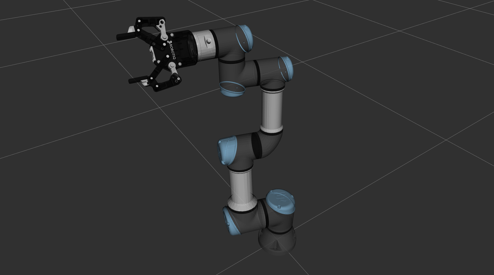

# ur_robotiq #

Automatic Addison ROS 2 support for UR robotic arms (specifically UR3e) made by Universal Robots with a 2F-85 adaptive gripper made by Robotiq.



## Contents

- `ur_robotiq_description`: Contains URDF/Xacro files for the combined UR3e and Robotiq 2F-85 setup
  - `urdf/ur3e_robotiq_2f_85_urdf.xacro`: Main Xacro file combining the UR3e arm and Robotiq gripper
  - `urdf/ur3e_urdf.xacro`: URDF/Xacro description for the UR3e arm
  - `urdf/robotiq_2f_85_urdf.xacro`: URDF/Xacro description for the Robotiq 2F-85 gripper

## Usage

To view this robot in RViz:

1. Clone this repository into your ROS 2 workspace
2. Build your workspace (i.e. colcon build)
3. Install the urdf_tutorial package for your ROS distribution:

```bash
sudo apt install ros-${ROS_DISTRO}-urdf-tutorial
```

4. To launch the URDF model viewer, use the following command:

```bash
ros2 launch urdf_tutorial display.launch.py model:=/home/ubuntu/ros2_ws/src/ur_robotiq/ur_robotiq_description/urdf/ur3e_robotiq_2f_85_urdf.xacro
```
This command will launch the URDF viewer with the Universal Robots robotic arm.

You can also type:

```bash
ros2 launch ur_description view_ur.launch.py ur_type:=ur3e
```

5. Remember to set the Fixed Frame under "Global Options" in RViz to the 'world' frame.

## Dependencies

- ROS 2 (tested on ROS 2 Iron)

## License

This project is licensed under the BSD 3-Clause License. See the LICENSE file for details.


